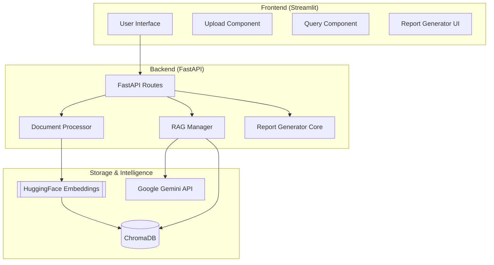
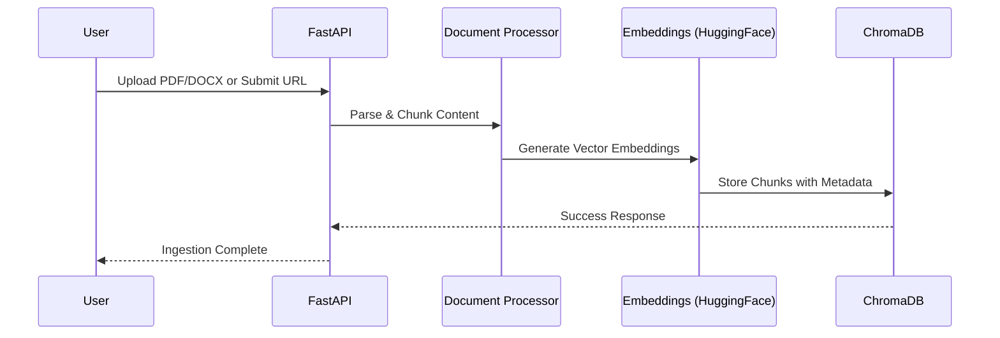
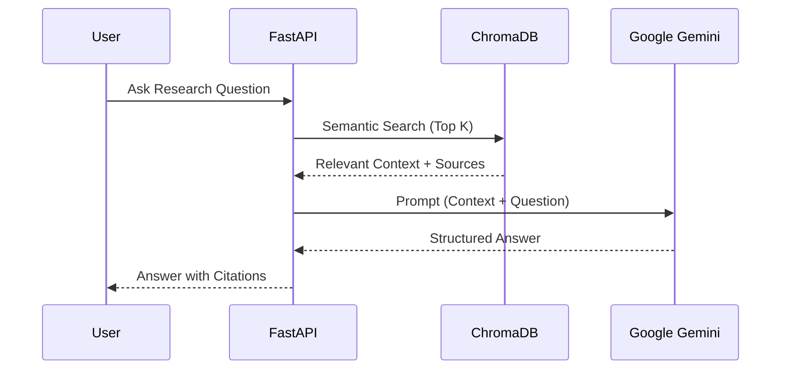

# Autonomous-Research-Analyst

[](https://fastapi.tiangolo.com/)
[](https://streamlit.io/)
[](https://www.langchain.com/)
[](https://deepmind.google/technologies/gemini/)
[](https://www.docker.com/)

An AI-powered research assistant designed to ingest complex reports, research papers, and web data to generate high-fidelity insights, structured reports, and presentation slides using a state-of-the-art **RAG (Retrieval-Augmented Generation)** pipeline.

---

## 🔗 Quick Links

- **Live Demo**: [🚀 Access the Dashboard](https://autonomous-research-analyst.streamlit.app)

---

## 🏗️ System Architecture

The application is built with a decoupled architecture, ensuring scalability and ease of deployment.



---

## 🔄 Core Workflows

### 1. Data Ingestion Flow
Transforming raw data into searchable knowledge.



### 2. Research & Analysis (RAG) Flow
Context-aware answering with citation tracking.



---

## ✨ Key Features

- **🚀 Multi-Source Ingestion**: Support for PDF, DOCX, and direct URL crawling.
- **🧠 Advanced RAG**: Powered by LangChain and local HuggingFace embeddings (`all-MiniLM-L6-v2`) for cost-efficient vector search.
- **💎 Premium UI**: A modern, dark-themed dashboard built with Streamlit for a seamless user experience.
- **📄 Professional Exports**: Instantly convert research findings into PDF reports or PowerPoint presentations.
- **🔗 Citation Tracking**: Every answer includes references to the source material to ensure factual accuracy.
- **🐳 Dockerized**: Fully containerized setup for consistent performance across environments.

---

## 🛠️ Tech Stack

- **Frontend**: Streamlit, Plotly (for data visualization).
- **Backend**: FastAPI, Uvicorn.
- **Orchestration**: LangChain.
- **Vector Store**: ChromaDB.
- **LLM**: Google Gemini 2.5 Flash.
- **Embeddings**: SentenceTransformers (Local CPU optimized).
- **Document Parsing**: PyPDF, python-docx, Beautiful Soup.
- **Reporting**: FPDF2

---

## 🚀 Getting Started

### Prerequisites
- Docker & Docker Compose
- Google Gemini API Key

### Environment Variables
The application requires several environment variables to function correctly. Create a `.env` file in the root directory:

| Variable | Description | Required |
| :--- | :--- | :--- |
| `GOOGLE_API_KEY` | Your Google Gemini API Key | Yes |
| `PORT` | Backend port (default: 8000) | No |
| `DEBUG` | Enable debug mode (true/false) | No |

### Quick Start (Docker)
1. Clone the repository.
2. Create a `.env` file in the root directory:
   ```env
   GOOGLE_API_KEY=your_gemini_api_key_here
   ```
3. Launch the stack:
   ```bash
   docker-compose up --build
   ```
4. Access the Dashboard: `http://localhost:8501`
5. Explore the API: `http://localhost:8000/docs`

### API Documentation
Once the backend is running, you can access the interactive Swagger documentation at:
- **Swagger UI**: `http://localhost:8000/docs`
- **ReDoc**: `http://localhost:8000/redoc`

Key Endpoints:
- `POST /ingest`: Upload and process documents.
- `POST /ingest_url`: Crawl and index web content.
- `POST /analyze`: Query the RAG engine for insights.
- `POST /generate_report`: Export results to PDF or Markdown.

---

### Manual Installation (Development)

**1. Backend Setup**
```bash
cd backend
python -m venv venv
source venv/bin/activate  # or venv\Scripts\activate
pip install -r requirements.txt
python main.py
```

**2. Frontend Setup**
```bash
cd frontend
pip install -r requirements.txt
streamlit run app.py
```

---

## 📖 Usage Guide

1. **Ingest Knowledge**: Use the **Ingestion** tab to upload your research materials or paste relevant URLs.
2. **Deep Analysis**: Switch to the **Analysis** tab to ask complex questions. The system will retrieve context and provide cited answers.
3. **Generate Reports**: In the **Reports** tab, review your insights and export them to PDF or Markdown for stakeholders.

---

## ⚠️ Limitations

- **Hallucination Risk**: While RAG significantly reduces hallucinations, the LLM may still generate incorrect information if the retrieved context is ambiguous or insufficient.
- **Processing Power**: Local embedding generation (`all-MiniLM-L6-v2`) is CPU-optimized but may be slow for extremely large document sets (thousands of pages) on low-end hardware.
- **Parsing Complexity**: Complex multi-column PDFs or documents with extensive nested tables may not parse perfectly using standard libraries.
- **Internet Dependency**: Requires a stable internet connection to communicate with the Google Gemini API.
- **Context Window**: Extremely long queries or very high `k` values for retrieval may exceed the prompt context window of the LLM.

---

## ✍️ Author

**Pranay Kale**
- GitHub: [@pranayk15](https://github.com/pranayk15)
- Email: pranaykale1506@gmail.com

---
