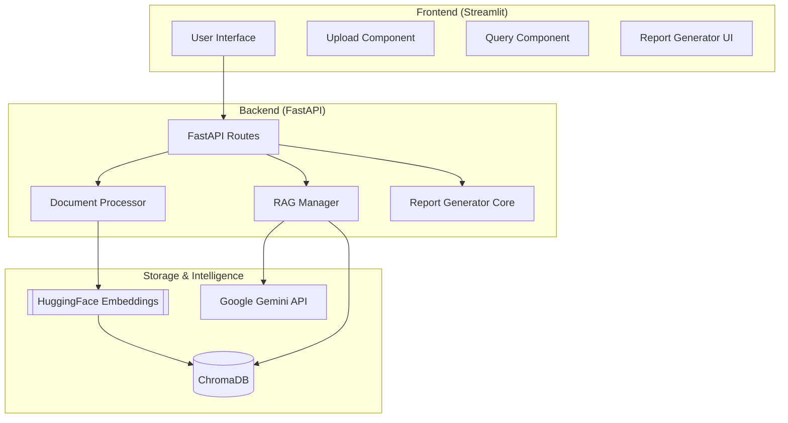
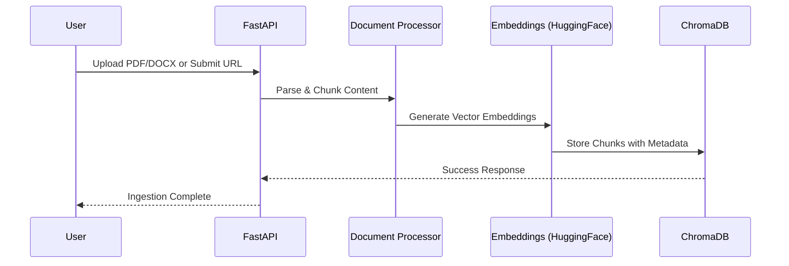
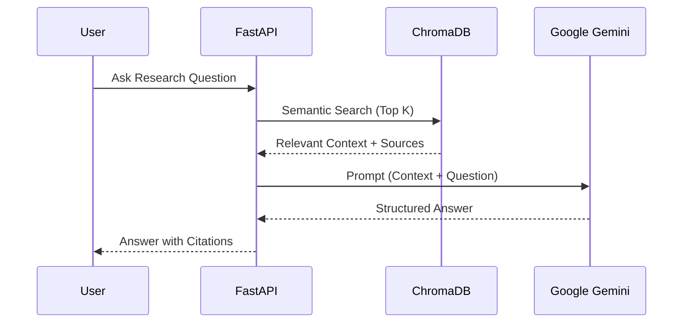

# Autonomous-Research-Analyst

[](https://fastapi.tiangolo.com/)
[](https://streamlit.io/)
[](https://www.langchain.com/)
[](https://deepmind.google/technologies/gemini/)
[](https://www.docker.com/)

An AI-powered research assistant designed to ingest complex reports, research papers, and web data to generate high-fidelity insights, structured reports, and presentation slides using a state-of-the-art **RAG (Retrieval-Augmented Generation)** pipeline.

---

## 🏗️ System Architecture

The application is built with a decoupled architecture, ensuring scalability and ease of deployment.



---

## 🔄 Core Workflows

### 1. Data Ingestion Flow
Transforming raw data into searchable knowledge.



### 2. Research & Analysis (RAG) Flow
Context-aware answering with citation tracking.



---

## ✨ Key Features

- **🚀 Multi-Source Ingestion**: Support for PDF, DOCX, and direct URL crawling.
- **🧠 Advanced RAG**: Powered by LangChain and local HuggingFace embeddings (`all-MiniLM-L6-v2`) for cost-efficient vector search.
- **💎 Premium UI**: A modern, dark-themed dashboard built with Streamlit for a seamless user experience.
- **📄 Professional Exports**: Instantly convert research findings into PDF reports or PowerPoint presentations.
- **🔗 Citation Tracking**: Every answer includes references to the source material to ensure factual accuracy.
- **🐳 Dockerized**: Fully containerized setup for consistent performance across environments.

---

## 🛠️ Tech Stack

- **Frontend**: Streamlit, Plotly (for data visualization).
- **Backend**: FastAPI, Uvicorn.
- **Orchestration**: LangChain.
- **Vector Store**: ChromaDB.
- **LLM**: Google Gemini 1.5 Flash.
- **Embeddings**: SentenceTransformers (Local CPU optimized).
- **Document Parsing**: PyPDF, python-docx, Beautiful Soup.
- **Reporting**: FPDF2, Python-PPTX.

---

### Manual Installation (Development)

**1. Backend Setup**
```bash
cd backend
python -m venv venv
source venv/bin/activate  # or venv\Scripts\activate
pip install -r requirements.txt
python main.py
```

**2. Frontend Setup**
```bash
cd frontend
pip install -r requirements.txt
streamlit run app.py
```

---

## 📖 Usage Guide

1. **Ingest Knowledge**: Use the **Ingestion** tab to upload your research materials or paste relevant URLs.
2. **Deep Analysis**: Switch to the **Analysis** tab to ask complex questions. The system will retrieve context and provide cited answers.
3. **Generate Reports**: In the **Reports** tab, review your insights and export them to PDF or Markdown for stakeholders.

---
